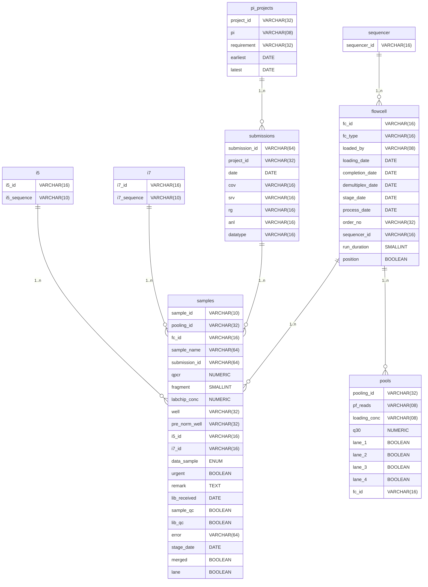

# Database

## Overview
This page provides detailed information about the PostgreSQL database schema in the platform and how it is populated. Two scripts are primarily responsible here:

1. When the `database/createDB.py` file is executed in [this step](2. setup.md#v-run-the-createdbpy-script), the database schema is created in the PostgreSQL database.
2. When the `database/insertDB.py` file is executed in [this step](2. setup.md#vi-run-the-insertdbpy-script), it connects to the database created in the previous step, reads data from various files in specified directories (primarily from the `raw.info` files), processes this data, and inserts it into the appropriate tables in the database.


## The Tables
Below are the schema details of the various tables in the database, along with the relevant code snippets from the `createDB.py` and `insertDB.py` scripts.

### Table 1: `i5`
This table contains information about i5 indices, which are used in the demultiplexing process during sequencing.
=== "Schema"
    | Attribute   | Data Type   | Constraints                          | Description             |
    |-------------|-------------|---------------------------------------|-------------------------|
    | i5_id       | VARCHAR(16) | PRIMARY KEY                           | Unique identifier for i5 index |
    | i5_sequence | VARCHAR(10) | DEFAULT NULL, CHECK (char_length(i5_sequence) >= 06) | The sequence of the i5 index |

=== "createDB.py"
    ``` py linenums="35"
    sql("CREATE TABLE i5 (\
          i5_id           VARCHAR(16) PRIMARY KEY,\
          i5_sequence     VARCHAR(10) DEFAULT NULL CHECK (char_length(i5_sequence) >= 06)\
      );")
    ```

=== "insertDB.py"
    ``` py linenums="50"
    # table 15
    try:
        cursor.execute("INSERT INTO i5 (i5_id, i5_sequence) VALUES ('%s', '%s');"%(row["INDEX_I5_ID"], row["INDEX_I5_sequencing"])) #ON CONFLICT (i5_id) DO NOTHING
    except:
        # print("i5_sequence already exists; checking for data integrity...")
        sql("SELECT i5_sequence FROM i5 WHERE i5_id = '%s';"%(row["INDEX_I5_ID"], ))
        data = cursor.fetchone()
        if data != None and data[0] != row["INDEX_I5_sequencing"]:
            print("entry with i5_index %s already exists with i5_sequence %s"%(row["INDEX_I5_ID"], data[0]))
    ```

### Table 2: `i7`

This table contains information about i7 indices, which are also used in the demultiplexing process during sequencing.

=== "Schema"
    
    | Attribute   | Data Type   | Constraints                          | Description             |
    |-------------|-------------|---------------------------------------|-------------------------|
    | i7_id       | VARCHAR(16) | PRIMARY KEY                           | Unique identifier for i7 index |
    | i7_sequence | VARCHAR(10) | DEFAULT NULL, CHECK (char_length(i7_sequence) >= 06) | The sequence of the i7 index |

=== "createDB.py"
    ``` py linenums="40"
    sql("CREATE TABLE i7 (\
          i7_id           VARCHAR(16) PRIMARY KEY,\
          i7_sequence     VARCHAR(10) DEFAULT NULL CHECK (char_length(i7_sequence) >= 06)\
      );")
    ```

=== "insertDB.py"
    ``` py linenums="62"
    #  table 17
    try:
        cursor.execute("INSERT INTO i7 (i7_id, i7_sequence) VALUES ('%s', '%s');"%(row["INDEX_I7_ID"], row["INDEX_I7_sequencing"])) #ON CONFLICT (i7_id) DO NOTHING
    except:
        # print("i7_sequence already exists; checking for data integrity...")
        sql("SELECT i7_sequence FROM i7 WHERE i7_id = '%s';"%(row["INDEX_I7_ID"], ))
        data = cursor.fetchone()
        if data != None and data[0] != row["INDEX_I7_sequencing"]:
            print("entry with i7_index %s already exists with i7_sequence %s"%(row["INDEX_I7_ID"], data[0]))
        # else:
            # print("data integrity checked for i7")
    ```

### Table 3: `sequencer`

This table contains information about sequencing machines used in the lab.

=== "Schema"
    
    | Attribute     | Data Type   | Constraints                | Description                      |
    |---------------|-------------|----------------------------|----------------------------------|
    | sequencer_id  | VARCHAR(16) | PRIMARY KEY                | Unique identifier for the sequencer machine |

=== "createDB.py"
    ``` py linenums="45"
    sql("CREATE TABLE sequencer (\
          sequencer_id    VARCHAR(16) PRIMARY KEY\
      );")
    ```

=== "insertDB.py"
    ``` py linenums="74"
    # table sequencer
    sql("INSERT INTO sequencer (sequencer_id) VALUES ('%s') ON CONFLICT (sequencer_id) DO NOTHING;"%(row["Sequencer"], ))
    ```

### Table 4: `pi_projects`

This table contains information about different projects, including the principal investigator associated with each project and the project's requirements and timeline.

=== "Schema"
    
    | Attribute   | Data Type   | Constraints                | Description                      |
    |-------------|-------------|----------------------------|----------------------------------|
    | project_id  | VARCHAR(32) | PRIMARY KEY                | Unique identifier for the project|
    | pi          | VARCHAR(08) | NOT NULL                   | Principal Investigator responsible for the project |
    | requirement | VARCHAR(32) | DEFAULT '_'                | Specific requirements or goals of the project |
    | earliest    | DATE        | DEFAULT NULL               | Earliest date associated with the project (e.g., proposal date) |
    | latest      | DATE        | DEFAULT NULL               | Latest or end date associated with the project |

=== "createDB.py"
    ``` py linenums="26"
    sql("CREATE TABLE pi_projects (\
          project_id      VARCHAR(32) PRIMARY KEY,\
          pi              VARCHAR(08) NOT NULL,\
          requirement     VARCHAR(32) DEFAULT '_',\
          earliest        DATE DEFAULT NULL,\
          latest          DATE DEFAULT NULL\
      );")
    ```

=== "insertDB.py"
    ``` py linenums="77"
    # table pi_projects
    try:
        cursor.execute("INSERT INTO pi_projects (project_id, pi, requirement) VALUES ('%s', '%s', '%s');"%(row["Project"], row["PI"], row["Data Requirement"]))
    except:
        # print("pi, project pair already exists; checking for data integrity...")
        sql("SELECT requirement FROM pi_projects WHERE project_id = '%s' AND pi = '%s';"%(row["Project"], row["PI"]))
        data = cursor.fetchone()
        if data != None and data[0] != row["Data Requirement"]:
            print("data requirement changed for project %s from %s to %s"%(row["Project"], data[0], row["Data Requirement"]))
        # else:
            # print("data integrity checked for pi_project")

    sql("SELECT earliest, latest FROM pi_projects WHERE project_id = '%s';"%(row["Project"]))
    data = cursor.fetchone()

    if data != None:
        assert(len(data) == 2)
        if data[0] == None or data[0] > row["Submission Date"]:
            sql("UPDATE pi_projects SET earliest = '%s' WHERE project_id = '%s' AND pi = '%s';"%(row["Submission Date"], row["Project"], row["PI"]))
        if data[1] == None or data[1] < row["Submission Date"]:
            sql("UPDATE pi_projects SET latest = '%s' WHERE project_id = '%s' AND pi = '%s';"%(row["Submission Date"], row["Project"], row["PI"]))
    else:
        print("date fetch failed")
    ```

### Table 5: `submissions`

This table contains information about project submissions, including the associated project, date of submission, and various metadata related to the sequencing process.

=== "Schema"
    
    | Attribute     | Data Type   | Constraints                                     | Description                      |
    |---------------|-------------|-------------------------------------------------|----------------------------------|
    | submission_id | VARCHAR(64) | PRIMARY KEY                                     | Unique identifier for submission |
    | project_id    | VARCHAR(32) | REFERENCES pi_projects (project_id)             | Linked project ID                |
    | date          | DATE        | NOT NULL, CHECK (date <= current_date)          | Date when the samples were submitted for sequencing |
    | cov           | VARCHAR(16) | DEFAULT '_'                                     | Coverage target for sequencing (e.g., 100x) |
    | srv           | VARCHAR(16) | DEFAULT '_'                                     | Type of sequencing service requested (e.g., Whole Genome, RNA-Seq) |
    | rg            | VARCHAR(16) | DEFAULT '_'                                     | Read Group information for BAM file header |
    | anl           | VARCHAR(16) | DEFAULT '_'                                     | Type of analysis to be performed on the data (e.g., Variant Calling) |
    | datatype      | VARCHAR(16) | NOT NULL                                        | Type of data (e.g., DNA, RNA) |

=== "createDB.py"
    ``` py linenums="49"
    sql("CREATE TABLE submissions (\
          submission_id   VARCHAR(64) PRIMARY KEY,\
          project_id      VARCHAR(32) REFERENCES pi_projects (project_id),\
          date            DATE NOT NULL CHECK (date <= current_date),\
          cov             VARCHAR(16) DEFAULT '_',\
          srv             VARCHAR(16) DEFAULT '_',\
          rg              VARCHAR(16) DEFAULT '_',\
          anl             VARCHAR(16) DEFAULT '_',\
          datatype        VARCHAR(16) NOT NULL\
      );")
    ```

=== "insertDB.py"
    ``` py linenums="101"
    #  table submissions
    try:
        cursor.execute("INSERT INTO submissions (submission_id, project_id, date, datatype) VALUES ('%s', '%s', '%s', '%s');"%(row["Submission ID"], row["Project"], row["Submission Date"], row["Datatype"]))
    except Exception as e:
        if not str(e).startswith("duplicate key value violates"):
            print(e)
        # print("submission_id already exists; checking for data integrity...")


    if row["Comments"] != "":
        comments = row["Comments"].split(" ")
        assert(len(comments) == 5)
        sid = comments[0].split(":")
        srv = comments[1].split(":")
        rg = comments[2].split(":")
        cov = comments[3].split(":")
        anl = comments[4].split(":")

        assert(len(sid) == 0 or (len(sid) == 2 and sid[0] == "SUB"))
        assert(len(srv) == 0 or (len(srv) == 2 and srv[0] == "SRV"))
        assert(len(rg) == 0 or (len(rg) == 2 and rg[0] == "RG"))
        assert(len(cov) == 0 or (len(cov) == 2 and cov[0] == "COV"))
        assert(len(anl) == 0 or (len(anl) == 2 and anl[0] == "ANL"))
        assert(sid[1] == row["Submission ID"])

        sql("SELECT srv, rg, cov, anl FROM submissions WHERE submission_id = '%s';"%(row["Submission ID"]))
        data = cursor.fetchone()
        # if data != None:
            # assert(len(data) == 4)

        if (data == None or data[0] == None or data[0] == "_") and srv[1] != "":
            sql("UPDATE submissions SET srv = '%s' WHERE submission_id = '%s' ;"%(srv[1], row["Submission ID"]))
        elif data[0] != srv[1]:
            print("service data changed for submission id '%s' from '%s' to '%s'"%(row["Submission ID"], data[0], srv[1]))

        if (data == None or data[1] == None or data[1] == "_") and rg[1] != "":
            sql("UPDATE submissions SET rg = '%s' WHERE submission_id = '%s' ;"%(rg[1], row["Submission ID"]))
        elif data[1] != rg[1]:
            print("ref_genome data changed for submission id '%s' from '%s' to '%s'"%(row["Submission ID"], data[1], rg[1]))

        if (data == None or data[2] == None or data[2] == "_") and cov[1] != "":
            sql("UPDATE submissions SET cov = '%s' WHERE submission_id = '%s' ;"%(cov[1], row["Submission ID"]))
        elif data[2] != cov[1]:
            print("coverage data changed for submission id '%s' from '%s' to '%s'"%(row["Submission ID"], data[2], cov[1]))

        if (data == None or data[3] == None or data[3] == "_") and anl[1] != "":
            sql("UPDATE submissions SET anl = '%s' WHERE submission_id = '%s' ;"%(anl[1], row["Submission ID"]))
        elif data[3] != anl[1]:
            print("analysis data changed for submission id '%s' from '%s' to '%s'"%(row["Submission ID"], data[3], anl[1]))
    ```

### Table 6: `flowcell`

This table contains detailed information about flowcells used in sequencing, including the type of flowcell, who loaded it, and various dates associated with the sequencing process.

=== "Schema"
    | Attribute       | Data Type   | Constraints                                       | Description                      |
    |-----------------|-------------|---------------------------------------------------|----------------------------------|
    | fc_id           | VARCHAR(16) | PRIMARY KEY                                       | Unique identifier for flowcell   |
    | fc_type         | VARCHAR(16) | NOT NULL, CHECK (char_length(fc_type) > 0)       | Type of flowcell (e.g., NovaSeq S4) |
    | loaded_by       | VARCHAR(08) | NOT NULL, CHECK (char_length(loaded_by) > 0)     | Lab member who loaded the flowcell onto the sequencer |
    | loading_date    | DATE        | NOT NULL, CHECK (loading_date <= current_date)   | Date when the flowcell was loaded onto the sequencer |
    | completion_date | DATE        | NOT NULL, CHECK (completion_date <= current_date), CHECK (completion_date >= loading_date) | Date when the sequencing run was completed |
    | demultiplex_date| DATE        | NOT NULL, CHECK (demultiplex_date <= current_date)| Date when the demultiplexing was completed |
    | stage_date      | DATE        | DEFAULT NULL, CHECK (stage_date <= current_date) | Date when the data was staged for analysis |
    | process_date    | DATE        | DEFAULT NULL, CHECK (process_date <= current_date)| Date when the data processing was completed |
    | order_no        | VARCHAR(32) | NOT NULL, CHECK (char_length(order_no) > 0)      | Order or batch number associated with the sequencing run |
    | sequencer_id    | VARCHAR(16) | REFERENCES sequencer (sequencer_id)              | Linked sequencer ID              |
    | run_duration    | SMALLINT    | CHECK ((run_duration ISNULL) OR (run_duration > 0)) DEFAULT NULL | Duration of the sequencing run in hours |
    | position        | BOOLEAN     | NOT NULL                                          | Position of the flowcell on the sequencer (e.g., left or right) |

=== "createDB.py"
    ``` py linenums="61"
    sql("CREATE TABLE flowcell (\
          fc_id           VARCHAR(16) PRIMARY KEY,\
          fc_type         VARCHAR(16) NOT NULL CHECK (char_length(fc_type) > 0),\
          loaded_by       VARCHAR(08) NOT NULL CHECK (char_length(loaded_by) > 0),\
          loading_date    DATE     NOT NULL CHECK (loading_date <= current_date),\
          completion_date DATE     NOT NULL CHECK (completion_date <= current_date),\
          demultiplex_date DATE    NOT NULL CHECK (demultiplex_date <= current_date),\
          stage_date       DATE    DEFAULT NULL CHECK (stage_date <= current_date),\
          process_date     DATE    DEFAULT NULL CHECK (process_date <= current_date),\
          order_no        VARCHAR(32) NOT NULL CHECK (char_length(order_no) > 0),\
          sequencer_id    VARCHAR(16) REFERENCES sequencer (sequencer_id),\
          run_duration    SMALLINT CHECK ((run_duration ISNULL) OR (run_duration > 0)) DEFAULT NULL,\
          position        BOOLEAN NOT NULL,\
          CHECK (completion_date >= loading_date)\
      );")
    ```

=== "insertDB.py"
    ``` py linenums="172"
    try:
        # print(row["Completion Date"])
        # print(row)
        cursor.execute("INSERT INTO flowcell (fc_id, fc_type, loaded_by, loading_date, completion_date, demultiplex_date, order_no, sequencer_id, position)\
        VALUES ('%s', '%s', '%s', '%s', '%s', '%s', '%s', '%s', '%s');"%(row["FC"], row["FC Type"], row["Loaded By"], row["Loading Date"], row["Completion Date"], row["Demultiplex Date"], row["Order No"], row["Sequencer"], row["Position"]))
        
    except Exception as e:
        # print(e)
        # print(row["Completion Date"])
        # print(row)
        # print("flowcell already exists; checking for data integrity...")
        sql("SELECT fc_type, loaded_by, loading_date, completion_date, demultiplex_date, order_no, sequencer_id, position FROM flowcell WHERE fc_id = '%s' ;"%(row["FC"])) # try except data integrity
        data = cursor.fetchone()
        if data != None:
            # print(data)
            assert(len(data) == 8)
            try:
                loading_date = datetime.datetime.strptime(row["Loading Date"], '%m/%d/%Y').date()
            except:
                loading_date = datetime.datetime.strptime(row["Loading Date"], '%Y-%m-%d').date()
            try:
                completion_date = datetime.datetime.strptime(row["Completion Date"], '%m/%d/%Y').date()
            except:
                completion_date = datetime.datetime.strptime(row["Completion Date"], '%Y-%m-%d').date()
            # demultiplex_date = datetime.datetime.strptime(row["Demultiplex Date", ])
            if data[0] != row["FC Type"]:
                print("FC Type data changed for flowcell %s from %s to %s"%(row["FC"], data[0], row["FC Type"]))
            if data[1] != row["Loaded By"]:
                print("Loaded By data changed for flowcell %s from %s to %s"%(row["FC"], data[1], row["Loaded By"]))
            if data[2] != loading_date:
                print("Loading Date data changed for flowcell %s from %s to %s"%(row["FC"], data[2], loading_date))
            if data[3] != completion_date:
                print("Completed Date data changed for flowcell %s from %s to %s"%(row["FC"], data[3], completion_date))
            if data[4] != row["Demultiplex Date"]:
                print("Demultiplex Date data changed for flowcell %s from %s to %s"%(row["FC"], data[4], row["Demultiplex Date"]))
            if data[5] != row["Order No"]:
                print("Order No data changed for flowcell %s from %s to %s"%(row["FC"], data[5], row["Order No"]))
            if data[6] != row["Sequencer"]:
                print("Sequencer data changed for flowcell %s from %s to %s"%(row["FC"], data[6], row["Sequencer"]))
            if data[7] != row["Position"]:
                print("position data changed for flowcell %s from %s to %s"%(row["FC"], data[7], row["Position"]))
            

        else:
            print("flowcell data fetch failed")
    ```

### Table 7: `pools`

This table contains information about pooled samples, which are mixtures of multiple samples that are sequenced together in a single lane of a flowcell.

=== "Schema"
    | Attribute   | Data Type   | Constraints                                       | Description                      |
    |-------------|-------------|---------------------------------------------------|----------------------------------|
    | pooling_id  | VARCHAR(32) | PRIMARY KEY                                       | Unique identifier for pooling    |
    | pf_reads    | VARCHAR(08) | NOT NULL                                          | Number of pass filter reads obtained from sequencing |
    | loading_conc| VARCHAR(08) | NOT NULL                                          | Concentration of the pooled sample loaded onto the flowcell |
    | q30         | NUMERIC(5, 3)| NOT NULL, CHECK ((q30 >= 0) AND (q30 <= 100))    | Percentage of bases with a Q30 quality score |
    | lane_1      | BOOLEAN     | NOT NULL, DEFAULT FALSE                          | Indicates whether the pool was sequenced in lane 1 |
    | lane_2      | BOOLEAN     | NOT NULL, DEFAULT FALSE                          | Indicates whether the pool was sequenced in lane 2 |
    | lane_3      | BOOLEAN     | NOT NULL, DEFAULT FALSE                          | Indicates whether the pool was sequenced in lane 3 |
    | lane_4      | BOOLEAN     | NOT NULL, DEFAULT FALSE                          | Indicates whether the pool was sequenced in lane 4 |
    | fc_id       | VARCHAR(16) | REFERENCES flowcell (fc_id)                      | Linked flowcell ID               |

=== "createDB.py"
    ``` py linenums="77"
    sql("CREATE TABLE pools (\
          pooling_id      VARCHAR(32) PRIMARY KEY,\
          pf_reads        VARCHAR(08) NOT NULL,\
          loading_conc    VARCHAR(08) NOT NULL,\
          q30             NUMERIC(5, 3) NOT NULL CHECK ((q30 >= 0) AND (q30 <= 100)),\
          lane_1          BOOLEAN  NOT NULL DEFAULT FALSE,\
          lane_2          BOOLEAN  NOT NULL DEFAULT FALSE,\
          lane_3          BOOLEAN  NOT NULL DEFAULT FALSE,\
          lane_4          BOOLEAN  NOT NULL DEFAULT FALSE,\
          fc_id           VARCHAR(16) REFERENCES flowcell (fc_id)\
    );")
    ```

=== "insertDB.py"
    ``` py linenums="218"
    # table pools
    try:
        cursor.execute("INSERT INTO pools (pooling_id, pf_reads, loading_conc, q30, fc_id) VALUES ('%s', '%s', '%s', '%s', '%s');"%(row["Pooling ID"], row["Reads (PF)"], row["Loading Conc."], row["Q30"], row["FC"]))
    except Exception as e:
        # print(e)
        # print("pools data already exists; checking for data integrity...")
        sql("SELECT pf_reads, loading_conc, q30, fc_id FROM pools WHERE pooling_id = '%s';"%(row["Pooling ID"])) # try except data integrity
        data = cursor.fetchone()
        if data != None:
            assert(len(data) == 4)
            if data[0] != row["Reads (PF)"]:
                print("pf_reads data changed for pool '%s' from '%s' to '%s'"%(row["Pooling ID"], data[0], row["Reads (PF)"]))
            if data[1] != row["Loading Conc."]:
                print("loading_conc data changed for pool '%s' from '%s' to '%s'"%(row["Pooling ID"], data[1], row["Loading Conc."]))
            if float(data[2]) != float(row["Q30"]):
                print("q30 data changed for pool '%s' from '%s' to '%s'"%(row["Pooling ID"], data[2], row["Q30"]))
            if data[3] != row["FC"]:
                print("fc_id data changed for pool '%s' from '%s' to '%s'"%(row["Pooling ID"], data[3], row["FC"]))
        else:
            print("pool data fetch failed")

    sql("SELECT lane_1, lane_2, lane_3, lane_4 FROM pools where pooling_id = '%s';"%(row["Pooling ID"]))
    data = cursor.fetchone()
    if data != None:
        assert(len(data) == 4)
        if data[0] == False and row["Lane"] == "L1":
            sql("UPDATE pools SET lane_1 = TRUE WHERE pooling_id = '%s';"%(row["Pooling ID"]))
        elif data[1] == False and row["Lane"] == "L2":
            sql("UPDATE pools SET lane_2 = TRUE WHERE pooling_id = '%s';"%(row["Pooling ID"]))
        if data[2] == False and row["Lane"] == "L3":
            sql("UPDATE pools SET lane_3 = TRUE WHERE pooling_id = '%s';"%(row["Pooling ID"]))
        if data[3] == False and row["Lane"] == "L4":
            sql("UPDATE pools SET lane_4 = TRUE WHERE pooling_id = '%s';"%(row["Pooling ID"]))
    else:
        print("pool lane data fetch failed")
    ```

### Custom Type: `status`

This custom type defines the possible statuses for a sample, indicating whether the sample is new, a top-up of a previous sample, or a repeat.
The `status` type is used in the `samples` table. 

=== "createDB.py"
    ``` py linenums="89"
    CREATE TYPE status AS ENUM ('New', 'Top-up', 'Repeat');
    ```

### Table 8: `samples`

This table contains detailed information about individual samples, including the associated pooling and flowcell information, quality control metrics, and various metadata related to the sequencing process.

=== "Schema"
    | Attribute     | Data Type   | Constraints                                       | Description                      |
    |---------------|-------------|---------------------------------------------------|----------------------------------|
    | sample_id     | VARCHAR(10) | NOT NULL, CHECK (char_length(sample_id) = 10)    | Unique identifier for sample     |
    | pooling_id    | VARCHAR(32) | REFERENCES pools (pooling_id)                    | Linked pooling ID                |
    | fc_id         | VARCHAR(16) | REFERENCES flowcell (fc_id)                      | Linked flowcell ID               |
    | sample_name   | VARCHAR(64) | NOT NULL                                          | Human-readable name of the sample |
    | submission_id | VARCHAR(64) | REFERENCES submissions (submission_id)           | Linked submission ID             |
    | qpcr          | NUMERIC(4, 2)| CHECK ((qpcr ISNULL) OR (qpcr >= 0)) DEFAULT NULL| QPCR concentration of the sample |
    | fragment      | SMALLINT    | NOT NULL, CHECK (fragment >= 0)                  | Fragment size of the library in base pairs |
    | labchip_conc  | NUMERIC(5, 2)| CHECK ((labchip_conc ISNULL) OR (labchip_conc >= 0)) DEFAULT NULL | Concentration measured by LabChip |
    | well          | VARCHAR(32) | NOT NULL, CHECK (char_length(well) > 0)          | Well position in the plate where the sample is located |
    | pre_norm_well | VARCHAR(32) | DEFAULT '_'                                      | Well position before normalization |
    | i5_id         | VARCHAR(16) | REFERENCES i5 (i5_id)                            | Linked i5 index ID               |
    | i7_id         | VARCHAR(16) | REFERENCES i7 (i7_id)                            | Linked i7 index ID               |
    | data_sample   | status      | NOT NULL                                          | Status of the sample (New, Top-up, Repeat) |
    | urgent        | BOOLEAN     | NOT NULL, DEFAULT FALSE                          | Flag indicating whether the sample is marked as urgent |
    | remark        | text        | DEFAULT '_'                                      | Additional remarks or notes about the sample |
    | lib_received  | DATE        | NOT NULL, CHECK (lib_received <= current_date)   | Date when the library was received for sequencing |
    | sample_qc     | BOOLEAN     | NOT NULL, DEFAULT FALSE                          | Quality control status of the sample |
    | lib_qc        | BOOLEAN     | NOT NULL, DEFAULT FALSE                          | Quality control status of the library |
    | error         | VARCHAR(64) | NOT NULL, DEFAULT '_'                            | Details of any errors associated with the sample |
    | stage_date    | DATE        | DEFAULT NULL, CHECK (stage_date <= current_date) | Date when the sample data was staged for analysis |
    | merged        | BOOLEAN     | DEFAULT FALSE                                    | Flag indicating whether the sample data was merged from multiple lanes |
    | lane          | BOOLEAN     | DEFAULT FALSE                                    | Flag indicating whether the sample was run in a dedicated lane |
    | PRIMARY KEY   | -           | (sample_id, fc_id)                               | Composite primary key based on sample ID and flowcell ID |

=== "createDB.py"
    ``` py linenums="91"
    sql("CREATE TABLE samples (\
          sample_id       VARCHAR(10) NOT NULL CHECK (char_length(sample_id) = 10),\
          pooling_id      VARCHAR(32) REFERENCES pools (pooling_id),\
          fc_id           VARCHAR(16) REFERENCES flowcell (fc_id),\
          sample_name     VARCHAR(64) NOT NULL,\
          submission_id   VARCHAR(64) REFERENCES submissions (submission_id),\
          qpcr            NUMERIC(4, 2) CHECK ((qpcr ISNULL) OR (qpcr >= 0)) DEFAULT NULL,\
          fragment        SMALLINT NOT NULL CHECK (fragment >= 0),\
          labchip_conc    NUMERIC(5, 2) CHECK ((labchip_conc ISNULL) OR (labchip_conc >= 0)) DEFAULT NULL,\
          well            VARCHAR(32) NOT NULL CHECK (char_length(well) > 0),\
          pre_norm_well   VARCHAR(32) DEFAULT '_',\
          i5_id           VARCHAR(16) REFERENCES i5 (i5_id),\
          i7_id           VARCHAR(16) REFERENCES i7 (i7_id),\
          data_sample     status NOT NULL,\
          urgent          BOOLEAN NOT NULL DEFAULT FALSE,\
          remark          text DEFAULT '_',\
          lib_received    DATE NOT NULL CHECK (lib_received <= current_date),\
          sample_qc       BOOLEAN NOT NULL DEFAULT FALSE,\
          lib_qc          BOOLEAN NOT NULL DEFAULT FALSE,\
          error           VARCHAR(64) NOT NULL DEFAULT '_',\
          stage_date       DATE    DEFAULT NULL CHECK (stage_date <= current_date),\
          merged          BOOLEAN DEFAULT FALSE,\
          lane            BOOLEAN DEFAULT FALSE,\
          PRIMARY KEY (sample_id, fc_id)\
      );")
    ```

=== "insertDB.py"
    ``` py linenums="254"
    # table samples
    sql("SELECT pooling_id, sample_name, submission_id, qpcr, fragment, labchip_conc, well, pre_norm_well, i5_id, i7_id, data_sample, urgent, remark, lib_received, sample_qc, lib_qc\
     FROM samples WHERE sample_id = '%s' AND fc_id = '%s';"%(row["Sample Name"], row["FC"]))
    data = cursor.fetchone()
    if data == None:
        sql("INSERT INTO samples (sample_id, pooling_id, fc_id, sample_name, submission_id, fragment, well, pre_norm_well, i5_id, i7_id, data_sample, urgent, remark, lib_received, sample_qc, lib_qc)\
        VALUES ('%s','%s','%s','%s','%s','%s','%s','%s','%s','%s','%s','%s','%s','%s','%s', '%s' );"%(row["Sample Name"], row["Pooling ID"], row["FC"], row["Original Sample Name"], row["Submission ID"], row["Fragment size (bp)"], row["Well"], row["Pre-Norm Well"], row["INDEX_I5_ID"], row["INDEX_I7_ID"], row["Data_Sample_Status"],
                                                                                                         row["Urgency"], row["Remark"], row["Libaries and info received date"], row["Sample QC P/F"], row["Lib QC P/F"]))
    else:
        assert(len(data) == 16)
        if data[0] != row["Pooling ID"]:
            print("Pooling ID data changed for sample '%s' and fc '%s' from '%s' to '%s'"%(row["Sample Name"], row["FC"], data[0], row["Pooling ID"]))
        if data[1] != row["Original Sample Name"]:
            print("Original Sample Name data changed for sample '%s' and fc '%s' from '%s' to '%s'"%(row["Sample Name"], row["FC"], data[1], row["Original Sample Name"]))
        if data[2] != row["Submission ID"]:
            print("Submission ID data changed for sample '%s' and fc '%s' from '%s' to '%s'"%(row["Sample Name"], row["FC"], data[2], row["Submission ID"]))
        if float(data[3]) != float(row["QPCR Conc. (nM) / iseq output"]):
            print("QPCR Conc. (nM) / iseq output data changed for sample '%s' and fc '%s' from '%s' to '%s'"%(row["Sample Name"], row["FC"], data[3], row["QPCR Conc. (nM) / iseq output"]))
        if int(data[4]) != int(row["Fragment size (bp)"]):
            print("Fragment size (bp) data changed for sample '%s' and fc '%s' from '%s' to '%s'"%(row["Sample Name"], row["FC"], data[4], row["Fragment size (bp)"]))
        if float(data[5]) != float(row["LabChip/Bioanalyzer Conc. (nM)"]):
            print("LabChip/Bioanalyzer Conc. (nM) data changed for sample '%s' and fc '%s' from '%s' to '%s'"%(row["Sample Name"], row["FC"], data[5], row["LabChip/Bioanalyzer Conc. (nM)"]))
        if data[6] != row["Well"]:
            print("Well data changed for sample '%s' and fc '%s' from '%s' to '%s'"%(row["Sample Name"], row["FC"], data[6], row["Well"]))
        if data[7] != row["Pre-Norm Well"]:
            print("Pre-Norm Well data changed for sample '%s' and fc '%s' from '%s' to '%s'"%(row["Sample Name"], row["FC"], data[7], row["Pre-Norm Well"]))
        if data[8] != row["INDEX_I5_ID"]:
            print("INDEX_i5_ID data changed for sample '%s' and fc '%s' from '%s' to '%s'"%(row["Sample Name"], row["FC"], data[8], row["INDEX_i5_ID"]))
        if data[9] != row["INDEX_I7_ID"]:
            print("INDEX_i7_ID data changed for sample '%s' and fc '%s' from '%s' to '%s'"%(row["Sample Name"], row["FC"], data[9], row["INDEX_i7_ID"]))
        if data[10] != row["Data_Sample_Status"]:
            print("Data_Sample_status data changed for sample '%s' and fc '%s' from '%s' to '%s'"%(row["Sample Name"], row["FC"], data[10], row["Data_Sample_status"]))
        if data[11] != row["Urgency"]:
            print("Urgency data changed for sample '%s' and fc '%s' from '%s' to '%s'"%(row["Sample Name"], row["FC"], data[11], row["Urgency"]))
        if data[12] != row["Remark"]:
            print("Remark data changed for sample '%s' and fc '%s' from '%s' to '%s'"%(row["Sample Name"], row["FC"], data[12], row["Remark"]))        
        if data[13] != datetime.datetime.strptime(row["Libaries and info received date"], "%Y%m%d").date():
            print("Libaries and info received date data changed for sample '%s' and fc '%s' from '%s' to '%s'"%(row["Sample Name"], row["FC"], data[13], row["Libaries and info received date"]))
        if data[14] != row["Sample QC P/F"]:
            print("Sample QC P/F data changed for sample '%s' and fc '%s' from '%s' to '%s'"%(row["Sample Name"], row["FC"], data[14], row["Sample QC P/F"]))
        if data[15] != row["Lib QC P/F"]:
            print("Lib QC P/F data changed for sample '%s' and fc '%s' from '%s' to '%s'"%(row["Sample Name"], row["FC"], data[15], row["Lib QC P/F"]))

    if row["QPCR Conc. (nM) / iseq output"] != "":
        sql("UPDATE samples SET qpcr = '%s' WHERE sample_id = '%s' AND fc_id = '%s';"%(row["QPCR Conc. (nM) / iseq output"], row["Sample Name"], row["FC"]))
    if row["LabChip/Bioanalyzer Conc. (nM)"] != "":
        sql("UPDATE samples SET labchip_conc = '%s' WHERE sample_id = '%s' AND fc_id = '%s';"%(row["LabChip/Bioanalyzer Conc. (nM)"], row["Sample Name"], row["FC"]))
    ```

### ERD


## The Process

The PostgreSQL database currently has 35 attributes overall. The directories having the files from which the data is extracted and populated in the database is to be configured during setup in [this step](2. setup.md#step-3-configure-the-database). The directories are:

```py title="database/insertDB.py" linenums="37"
  # Set up the paths
  directory_path = "./input-data-for-externs/FC multiqc"
  directory = "./input-data-for-externs"
  fcqc_directory = directory + "/flowcell-qc-reports"
  rawinfo_directory = directory + "/rawinfo-dirs"
  runs_directory = directory + "/Runs"
```

The following is a detailed walkthrough of the database population process from the `insertDB.py` script.

### main Function
The `main` function is the entry point of the script. It:

1. Finds all the HTML files in the flowcell subdirectories under `flowcell-qc-reports` directory. 
2. Extracts the flowcell IDs from these filenames and stores them in a list `FC`.
!!! Danger
    The date it is found and the path for the corresponding HTML file for every FC is saved in the database.
```python linenums="408"
def main():
    FC = []
    subdirectories = [entry.name for entry in os.scandir(fcqc_directory) if entry.is_dir()]

    for dir in subdirectories:
        subdir = fcqc_directory + "/" + dir
        html_files = glob.glob(os.path.join(subdir, "*.html"))
        if html_files:
            for html_file_path in html_files:
                print(datetime.datetime.now(), " : Found HTML file generated for .", html_file_path)
                fc = html_file_path.split("/")[-1]
                FC.append(fc.split(".")[0])
```
3. Queries the database to find which of these flowcells have already been demultiplexed and stores their IDs in a set `demultiplexed_FC`.
```python linenums="421"
    sql("SELECT fc_id FROM flowcell;")
    data = cursor.fetchall()

    demultiplexed_FC = set()
    for row in data:
        demultiplexed_FC.add(row[0])
```
4. For each flowcell ID in `FC` that is not in `demultiplexed_FC`, calls the `store_fc` function to process and store the data for that flowcell.
```python linenums="428"
    for fc in FC:
        if fc not in demultiplexed_FC:
            store_fc(fc)
            print(datetime.datetime.now(), " : Data stored in the database for fc" + fc)
    
    return 0

main()
```
### store_fc Function
The `store_fc` function is the core of the script. It processes data related to a specific flowcell (`fc`). For each flowcell, it:
1. Finds the corresponding raw information file from a directory of raw information files.
2. Reads and processes the data from this file.
3. Constructs a dictionary (`row`) for each line in the file, where the keys are field names and the values are the data for those fields.
4. Modifies and cleans this data as necessary (e.g., parsing dates, converting strings to booleans, etc.).
5. Calls the `store_row` function (not shown in the script) to insert this processed data into the appropriate tables in the database.

```python
def store_fc(fc):
    ...
    for line in raw_info_file:
        row = dict()
        ...
        store_row(row)
```

## The Process:

1. **Connecting to the Database**: The script starts by establishing a connection to the PostgreSQL database and creating a cursor object to interact with the database.

2. **Reading and Processing Files**: For each flowcell, the script reads the corresponding raw information file, processes this data, and constructs a dictionary for each line in the file.

3. **Data Cleaning and Transformation**: The script performs various data cleaning and transformation tasks, such as parsing dates, converting strings to booleans, and renaming, adding, or removing fields as necessary.

4. **Storing Data in the Database**: After processing the data for each flowcell, the script calls a separate `store_row` function to insert this data into the appropriate tables in the database.

5. **Checking for Existing Data**: Before inserting data for a flowcell, the script checks whether data for that flowcell has already been demultiplexed and stored in the database. If so, it skips that flowcell to avoid duplicate data.

6. **Logging and Error Handling**: Throughout the script, there are print statements that log the progress of the script, and exception handling that prints errors when SQL commands fail to execute.

This script is designed to be run periodically to update the database with new data as new flowcells are processed and new raw information files are generated.